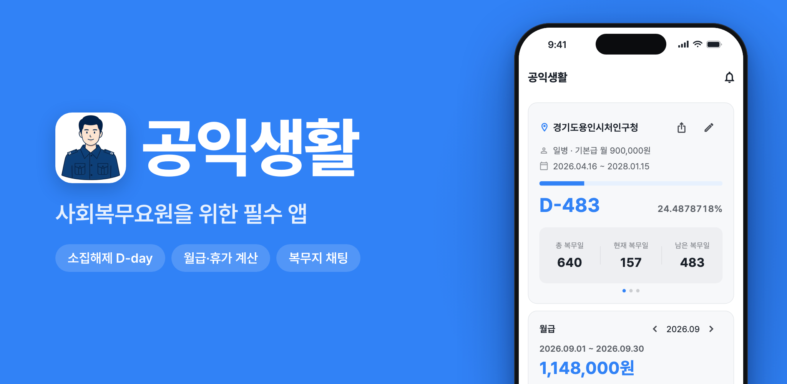

# 공익생활

**사회복무요원을 위한 필수 앱**

현직 사회복무요원이 직접 만든 앱

소집해제 D-day부터 휴가·월급 계산, 복무지 채팅까지. 
사회복무요원의 복무 생활을 한 앱에 담았어요.

  

## 복무 생활에 필요한 전부

현직 사회복무요원이 직접 만들었어요. 병역법 기준의 정확한 계산부터 복무지 커뮤니티까지 챙겼어요.

| | 기능 | 이런 걸 할 수 있어요 |
|:-:|---|---|
| 📅 | **복무 현황** | 소집해제 D-day와 실시간 복무율, 진급일까지 자동 계산해요. 홈 화면·잠금 화면 위젯으로 바로 확인하고, 반환점·D-100 이정표는 카드로 공유해요. |
| 🏖️ | **휴가 관리** | 연가·병가·외출 등 12종 휴가의 잔여 일수를 자동 집계해요. 주말·공휴일 포함은 건마다 선택하고, 징검다리 휴가도 추천해요. |
| 💰 | **월급·군적금 계산** | 계급별 월급과 식비·교통비, 장병내일준비적금 만기 예상 수령액을 한눈에 확인하고 월급날 알림도 받아요. |
| 💬 | **복무지 채팅** | 같은 복무지 요원들과 실시간으로 대화하고, 전체 채팅방과 훈련소 동기 채팅방에서 전국 요원들과 소통해요. |
| ⭐ | **복무지 검색·리뷰** | 전국 복무기관을 검색하고, 실제 복무 중인 요원들의 후기로 분위기와 업무를 미리 파악해요. |
| 📝 | **커뮤니티·Q&A** | 사회복무요원 게시판과 재지정·분할복무 익명 Q&A, 복무지별 합격 스택 통계까지 함께 나눠요. |
| ⏳ | **소집 대기 도구** | 본인선택·재학생입영원 접수 일정을 알림으로 받고, 장기대기 전시근로역 편입 예정일을 계산해요. |
| 🎖️ | **훈련소 준비** | 입소 D-day와 입소 준비 체크리스트, 같은 부대·입소일 동기 채팅방으로 훈련소를 미리 준비해요. |
| 🎁 | **행운 뽑기** | 광고 한 번 보고 응모하면 기프티콘 추첨 기회가! 소소한 복무 중 즐거움을 챙겨요. |

## 복무 단계마다 이렇게 써요

**소집을 기다리는 중이라면**
- 본인선택·재학생입영원 접수 일정을 놓치지 않게 알림으로 받아요.
- 복무지 리뷰와 합격 스택 통계로 어디에 지원할지 미리 가늠해요.

**훈련소 입소를 앞뒀다면**
- 입소 D-day와 준비물 체크리스트로 빠짐없이 챙겨요.
- 같은 부대·같은 입소일 동기들과 먼저 인사해요.

**복무 중이라면**
- 복무 정보만 입력하면 D-day·복무율·진급일·월급이 자동으로 계산돼요.
- 남은 연가·병가를 한눈에 보고, 징검다리 휴가 추천으로 알차게 써요.
- 같은 복무지 요원들과 채팅하고, 재지정·분할복무 고민은 익명으로 물어봐요.

## 다운로드

무료로 이용할 수 있어요.

- **iOS** — [App Store에서 받기](https://apps.apple.com/kr/app/id6807288062)
- **Android** — [Google Play에서 받기](https://play.google.com/store/apps/details?id=com.gongiklife.app)

## 소식·문의

- 홈페이지 — [gongiklife.com](https://gongiklife.com)
- 공지사항 — [gongiklife.com/notices](https://gongiklife.com/notices)
- 이벤트 — [gongiklife.com/events](https://gongiklife.com/events)
- 문의 — [contact@gongiklife.com](mailto:contact@gongiklife.com)
- 버그 제보·기능 제안 — [Issues](https://github.com/ParkMyungJae/gongiklife/issues)에 남겨 주세요. 하나하나 읽고 있어요.

[이용약관](https://gongiklife.com/terms) · [개인정보처리방침](https://gongiklife.com/privacy)

---

이 저장소는 공익생활 앱을 소개하는 공간이에요.

© 2026 공익생활. All rights reserved.

